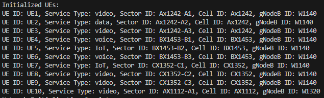
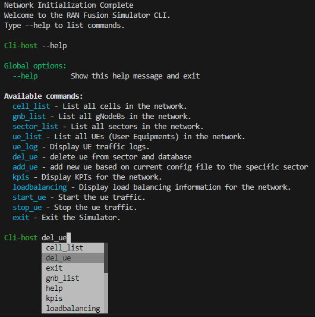
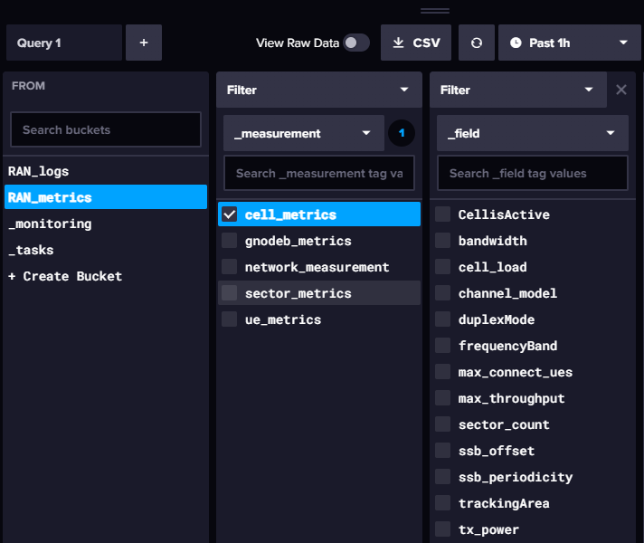

<<<<<<< HEAD
# Welcome to RANFusion  
#  


## Overview
  **RANFusion Simulator** is a tool designed to simulate the behavior and performance of 5G network components. Our simulator offers a detailed framework to test and analyze various components of 5G technology, including the RAN functionalities, behavior, and performance of 5G networks, This version (1.0.0) focuses on handover processes.

### Sample Results

- **Initial UE Configuration**

  

- **Simulation Logs**

  

- **Command Line menu**

  

- **InfluxDB GUI for Performance Metrics**

  

## Features

- **Realistic RAN Simulation:** Models 5G network elements and protocols accurately.
- **Multi-Support:** For multiple gNodeB, Cells, Sectors, and UEs.
- **API Enabled:** To add, remove, and update UEs with parameters.
- **CLI/CD Enabled:** To see the state of each entity.
- **Customizable Scenarios:** For configuring various network scenarios.
- **Supported Scenarios:** Traffic generation for UEs and soft handover within gNodeB.
- **Performance Metrics via InfluxDB:** Comprehensive metrics for insightful 5G network analysis.

## Getting Started

### Prerequisites

- **Operating System:** Windows, Linux, or macOS.
- **Python:** Version 3.x.
- **Dependencies:** Install InfluxDB and Libraries via `pip install -r requirements.txt`.

### Installation Guide

1. **Clone the Repository:** Obtain the project on your machine.
2. **Navigate:** Move to the project directory.
3. **InfluxDB**  Make sure influxDB separately install on you machine
4. **Setup:** Execute `setup.py` and wait.
5. **InfluxDB:** Install and setup on your machine.
6. **API Token:** Get the API token from InfluxDB GUI (`http://localhost:8086/`).
7. **Configure:** Insert the token into `setup.py`.
8. **Run:** Start the simulation with `main.py`.
9. **Send command via API:** Start a new terminal and past a sample API like add or remove ue.
 
## Documentation
Explore RANFusion further in our documentation.(https://RANFusion.com/doc).

### API Sample

To remove a UE, for example, remove "UE10" from sector "AX1112-A1" :
```powershell
Invoke-RestMethod -Uri 'http://localhost:5000/del_ue' -Method Post -ContentType 'application/json' -Body '{"ue_id": "10"}'
```

To receive a UE metric, for example, "UE10" :
```powershell
Invoke-RestMethod -Uri 'http://localhost:5000/ue_metrics?ue_id=10' -Method Get
```
To change a UE traffic, for example, "UE10" :
```powershell
Invoke-RestMethod -Uri 'http://localhost:5000/set_traffic' -Method Post -ContentType 'application/json' -Body '{"ue_id": "5", "traffic_params": {"throughput": 30}}'
```

To add a UE for example add "UE11" to sector "AX1112-A1" :
```powershell
Invoke-RestMethod -Uri 'http://localhost:5000/add_ue' -Method Post -ContentType 'application/json' -Body '{
  "ue_id": "42",
  "service_type": "data",
  "sector_id": "AX1112-A1",
  "gnodeb_id": "",
  "IMEI": "",
  "location": {
    "latitude": 42.2745,
    "longitude": -71.8064
  },
  "connectedCellID": "",
  "isMobile": "",
  "initialSignalStrength": 0.75,
  "rat": "NR",
  "maxBandwidth": 200,
  "duplexMode": "TDD",
  "txPower": 23,
  "modulation": [
    "QPSK"
  ],
  "coding": "LDPC",
  "mimo": "2x2",
  "processing": "Category 4",
  "bandwidthParts": [
    50
  ],
  "channelModel": "TDL-C",
  "velocity": 50,
  "direction": 135,
  "trafficModel": "Full Buffer",
  "schedulingRequests": true,
  "rlcMode": "AM",
  "snrThresholds": [
    18
  ],
  "hoMargin": 6,
  "n310": 1,
  "n311": 5,
  "model": "Iphon14 pro",
  "screensize": "6.12",
  "batterylevel": 80,
  "datasize": ""
}'
```
=======
# Welcome to RANFusion  
#  


## Overview
  **RANFusion Simulator** is a tool designed to simulate the behavior and performance of 5G network components. Our simulator offers a detailed framework to test and analyze various components of 5G technology, including the RAN functionalities, behavior, and performance of 5G networks, This version (1.0.0) focuses on handover processes.

### Sample Results

- **Initial UE Configuration**

  

- **Simulation Logs**

  

- **InfluxDB GUI for Performance Metrics**

  

## Features

- **Realistic RAN Simulation:** Models 5G network elements and protocols accurately.
- **Multi-Support:** For multiple gNodeB, Cells, Sectors, and UEs.
- **API Enabled:** To add, remove, and update UEs with parameters.
- **CLI/CD Enabled:** To see the state of each entity.
- **Customizable Scenarios:** For configuring various network scenarios.
- **Supported Scenarios:** Traffic generation for UEs and soft handover within gNodeB.
- **Performance Metrics via InfluxDB:** Comprehensive metrics for insightful 5G network analysis.

## Getting Started

### Prerequisites

- **Operating System:** Windows, Linux, or macOS.
- **Python:** Version 3.x.
- **Dependencies:** Install via `pip install -r requirements.txt`.

### Installation Guide

1. **Clone the Repository:** Obtain the project on your machine.
2. **Navigate:** Move to the project directory.
3. **Setup:** Execute `setup.py` and wait.
4. **InfluxDB:** Install and setup on your machine.
5. **API Token:** Get the API token from InfluxDB GUI (`http://localhost:8086/`).
6. **Configure:** Insert the token into `setup.py`.
7. **Run:** Start the simulation with `main.py`.
8. **Run API:** Start the `API.py` in a separate terminal
9. **Send command:** Start a new terminal and past a sample API like add or remove ue.
 
## Documentation
Explore RANFusion further in our documentation.(https://RANFusion.com/doc).

### API Sample

To remove a UE, for example, remove "UE10" from sector "AX1112-A1" :
```powershell
Invoke-RestMethod -Uri 'http://localhost:5000/del_ue' -Method Post -ContentType 'application/json' -Body '{"ue_id": "10"}'
```

To receive a UE metric, for example, "UE10" :
```powershell
Invoke-RestMethod -Uri 'http://localhost:5000/ue_metrics?ue_id=10' -Method Get
```
To change a UE traffic, for example, "UE10" :
```powershell
Invoke-RestMethod -Uri 'http://localhost:5000/set_traffic' -Method Post -ContentType 'application/json' -Body '{"ue_id": "5", "traffic_params": {"throughput": 30}}'
```

To add a UE for example add "UE11" to sector "AX1112-A1" :
```powershell
Invoke-RestMethod -Uri 'http://localhost:5000/add_ue' -Method Post -ContentType 'application/json' -Body '{
  "ue_id": "42",
  "service_type": "data",
  "sector_id": "AX1112-A1",
  "gnodeb_id": "",
  "IMEI": "",
  "location": {
    "latitude": 42.2745,
    "longitude": -71.8064
  },
  "connectedCellID": "",
  "isMobile": "",
  "initialSignalStrength": 0.75,
  "rat": "NR",
  "maxBandwidth": 200,
  "duplexMode": "TDD",
  "txPower": 23,
  "modulation": [
    "QPSK"
  ],
  "coding": "LDPC",
  "mimo": "2x2",
  "processing": "Category 4",
  "bandwidthParts": [
    50
  ],
  "channelModel": "TDL-C",
  "velocity": 50,
  "direction": 135,
  "trafficModel": "Full Buffer",
  "schedulingRequests": true,
  "rlcMode": "AM",
  "snrThresholds": [
    18
  ],
  "hoMargin": 6,
  "n310": 1,
  "n311": 5,
  "model": "Iphon14 pro",
  "screensize": "6.12",
  "batterylevel": 80,
  "datasize": ""
}'
```
>>>>>>> 8b323bd4ffb97cfe50b5a671c895b66bf65f93b8
